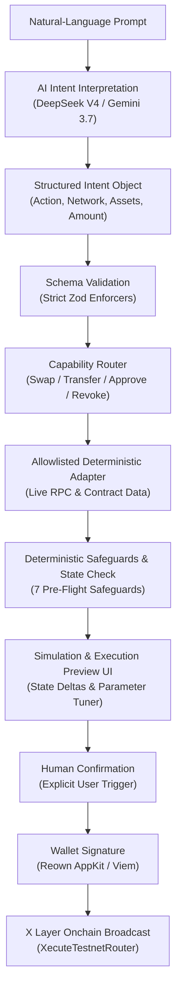

# Xecute · AI Execution & Intelligence Terminal for X Layer

> **Prompt it. Preview it. Xecute it.**
> 
> A chat-first execution terminal and ecosystem intelligence engine for X Layer. Describe your intent in plain English—Xecute verifies live onchain state, applies deterministic safeguards, previews state deltas, and executes human-confirmed transactions on X Layer Testnet.

---

## Why Xecute?

DeFi users are forced to juggle DEXs, explorers, approval scanners, and yield aggregators just to take simple actions. While LLMs offer a natural conversational interface, raw AI in financial execution is dangerous—models hallucinate contract addresses, fabricate quotes, and construct invalid transactions.

**Xecute solves this with a strict boundary:**
- **AI discovers intent & extracts parameters.**
- **Deterministic code verifies onchain state, enforces safety policy, and executes transactions with explicit wallet confirmation.**

---

## Deployment & Network Model

| Environment | Chain ID | Focus | Capabilities |
| :--- | :---: | :--- | :--- |
| **X Layer Testnet** | `1952` | **Live Execution** | Swaps, Direct Transfers, Approvals, Revocations, Faucet routing |
| **X Layer Mainnet** | `196` | **Intelligence & Risk** | Protocol Discovery, Yield Scouting, Wallet Approval Audits, Scenario Simulation |

---

## Core Capabilities

### 1. Act · Intent-Driven Execution (Testnet)
- **Conversational Swaps**: Converts *"Swap 100 USDT to xETH with 0.5% slippage"* into verified routes using the deployed [`XecuteTestnetRouter`](https://www.okx.com/web3/explorer/xlayer-test/address/0x9be3af8223f49b9357941db269a39775f7802acb).
- **Direct Transfers**: Validates recipient checksums, token decimals, and gas reserves before preparing native OKB or ERC-20 transfers.
- **Granular Approvals & Revocations**: Inspects existing allowances and constructs exact approvals or zero-allowance revocations—never defaulting to unlimited risk.
- **Action-Specific Previews**: Generates dedicated confirmation cards with exact Pay/Receive balance deltas and slippage controls instead of raw calldata.

### 2. Advise · Verified Ecosystem Intelligence (Mainnet)
- **Deterministic Protocol Registry**: Curated indexing of verified X Layer protocols (DEXs, Lending, Yield) with official contract addresses and deep links.
- **Real-Time Market & Yield Scouting**: Live reserve data from protocols like Aave V3 and Uniswap V3 on X Layer without AI hallucinations.

### 3. Protect · Wallet & Permission Scanner
- **Live Onchain Allowance Audit**: Scans active `Approval` events and checks live token `allowance(owner, spender)` contracts.
- **Evidence-Backed Findings**: Flags risky permissions (unlimited allowances, EOA spenders, unverified proxies) without arbitrary AI risk scores.

### 4. Predict · Portfolio Scenario Engine
- **Stress-Testing**: Computes instant portfolio exposure deltas under market conditions (e.g., *"What happens to my wallet if OKB drops 10%?"*).
- **Transaction Simulation**: Evaluates price impact, minimum received output, and gas requirements prior to signing.

---

## Architecture & Security Boundary



### 7 Deterministic Pre-Flight Safeguards
1. **Gas Reserve Protection**: Enforces $\ge 0.005\text{ OKB}$ native buffer to prevent stranded wallets.
2. **Slippage Ceiling**: Caps execution slippage to $\le 5.0\%$.
3. **Network Isolation**: Enforces execution enabled on Testnet (`1952`) and advisory-only on Mainnet (`196`).
4. **Address Checksum Validation**: Prevents burns or malformed recipient inputs.
5. **Real-Time Balance Verification**: Re-checks onchain balances immediately before proposing an action.
6. **Transaction Simulation**: Dry-runs transactions against live contract state; fails closed on error.
7. **Human-in-the-Loop**: No autonomous signing—every state mutation requires an explicit Web3 wallet signature.

---

## Smart Contracts & Deployments

| Network | Chain ID | Contract | Address | Explorer |
| :--- | :--- | :--- | :--- | :--- |
| **X Layer Testnet** | `1952` | `XecuteTestnetRouter` | `0x9be3af8223f49b9357941db269a39775f7802acb` | [View on OKX Explorer](https://www.okx.com/web3/explorer/xlayer-test/address/0x9be3af8223f49b9357941db269a39775f7802acb) |

---

## Tech Stack

- **Frontend**: Next.js 16 (App Router), React 19, TypeScript, Tailwind CSS v4, Radix UI
- **AI Orchestration**: Hybrid model routing (DeepSeek V4, Gemini 3.7 Flash) with local deterministic fallback
- **Web3 & Wallets**: Reown AppKit, Wagmi v2, Viem v2
- **Persistence**: Neon Serverless Postgres, Drizzle ORM
- **Smart Contracts**: Solidity ^0.8.20

---

## Getting Started

```bash
# 1. Clone & install
git clone https://github.com/eugenennamdi/xecute.git
cd xecute && npm install

# 2. Configure environment
cp .env.example .env.local
# Add GEMINI_API_KEY / DEEPSEEK_API_KEY, DATABASE_URL, and NEXT_PUBLIC_REOWN_PROJECT_ID

# 3. Migrate database & run dev server
npm run db:migrate && npm run db:seed
npm run dev
```

---

## Verification & Tests

Xecute includes 40 automated unit and integration tests covering intent parsing, safety guardrails, RPC lookups, and routing:

```bash
npm run typecheck   # Type check
npm test            # 40/40 passing unit & integration tests
npm run build       # Production build
```
