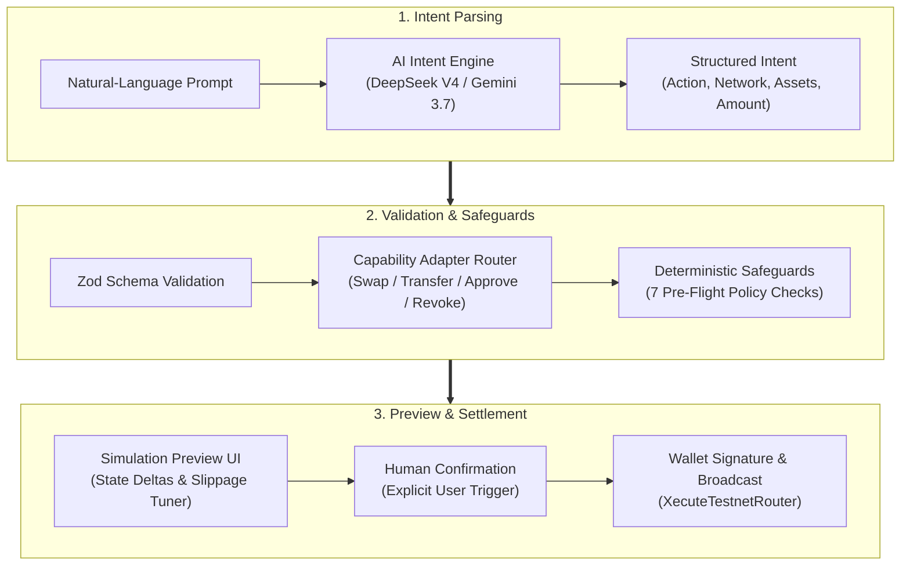

# Xecute · AI Execution Terminal for [X Layer](https://web3.okx.com/onchainos/dev-docs/xlayer/developer/build-on-xlayer/about-xlayer)

> **Execute anything on [X Layer](https://web3.okx.com/onchainos/dev-docs/xlayer/developer/build-on-xlayer/about-xlayer).**  
> Natural-language execution, verified onchain state, deterministic safeguards, and human-confirmed transactions.

[](https://xecute.xyz/)
[](https://www.okx.com/web3/explorer/xlayer-test/address/0x9be3af8223f49b9357941db269a39775f7802acb)
[](#verification--tests)

**Prompt it. Preview it. Xecute it.**

---

## What is Xecute?

Xecute is a chat-first execution and ecosystem intelligence terminal for **X Layer**.

Instead of moving between DEXs, explorers, yield dashboards, approval scanners, and protocol interfaces, users describe what they want to do in plain English:

- *"Swap 25 USDT to OKB with max 0.5% slippage."*
- *"Send 5 USDC to 0x..."*
- *"Where can I earn with USDT on X Layer?"*
- *"Scan my wallet for risky approvals and revoke USDC."*
- *"What happens to my wallet if OKB drops 10%?"*

Xecute converts that intent into structured parameters, verifies the required onchain state, applies deterministic safety policies, previews the exact balance deltas, and waits for explicit user confirmation before execution.

> **The AI understands the intent. Deterministic code controls the execution.**

---

## Current Release Matrix

Xecute deliberately separates execution from intelligence during the current release:

| Capability | X Layer Testnet (`1952`) | X Layer Mainnet (`196`) |
| :--- | :---: | :---: |
| **Role** | **Execute** | **Read & Advise** |
| Onchain reads & balances | ✓ | ✓ |
| Wallet intelligence & nonces | ✓ | ✓ |
| Token swaps | **✓ (Live onchain router)** | Quote / discovery |
| Direct transfers (OKB & ERC-20) | **✓ (Live onchain)** | Read-only |
| Exact approvals & revocations | **✓ (Live onchain)** | Read-only inspect |
| Protocol & yield discovery | ✓ | **✓ (Live Aave / Uniswap data)** |
| Scenario portfolio stress-testing | ✓ | ✓ |
| **State-changing execution** | **✓ Enabled** | **✕ Intentionally gated** |

> **Testnet proves Xecute can act. Mainnet proves Xecute understands X Layer.**

---

## Core Capabilities

### 1. Act · Natural-Language Execution (Testnet)
- **Swaps**: Conversational trading via the deployed [`XecuteTestnetRouter`](https://www.okx.com/web3/explorer/xlayer-test/address/0x9be3af8223f49b9357941db269a39775f7802acb).
- **Direct Transfers**: Validates recipient checksums, token decimals, and gas reserves before preparing native OKB or ERC-20 transfers.
- **Granular Approvals & Revocations**: Inspects existing allowances and constructs exact approvals or zero-allowance revocations—never defaulting to unlimited risk.
- **Gas-Aware Faucet Assistance**: Deep links to the official OKX X Layer faucet with real-time balance checks.
- **Human-Confirmed Signing**: Every state mutation produces an interactive confirmation card requiring an explicit Web3 wallet signature.

### 2. Advise · Verified Ecosystem Intelligence (Mainnet)
- **Deterministic Protocol Registry**: Curated indexing of verified X Layer protocols (DEXs, Lending, Yield) with official contract addresses and deep links.
- **Real-Time Market & Yield Scouting**: Live reserve data from protocols like Aave V3 and Uniswap V3 on X Layer without AI hallucinations.
- Dynamic values are only shown when Xecute can retrieve them from a supported onchain or API source.

### 3. Protect · Onchain Wallet & Permission Scanner
- **Live Approval Discovery**: Scans historical `Approval` events and queries current `allowance(owner, spender)` state onchain.
- **Evidence-Backed Findings**: Distinguishes EOAs from smart contracts via `eth_getCode` and flags unlimited permissions or unverified spenders without arbitrary AI security scores.
- **1-Click Revocation**: Proposes immediate zero-allowance revocation transactions for any active approval.

### 4. Predict · Portfolio Scenario Engine
- **Stress-Testing**: Computes instant portfolio exposure deltas under market conditions (e.g. *"What happens to my wallet if OKB drops 10%?"*).
- **Simulation vs. Prediction**: Predict models hypothetical market scenarios; simulation validates proposed transaction execution before signing.

---

## Architecture & Security Boundary



### 7 Deterministic Pre-Flight Safeguards
1. **Gas Reserve Protection**: Enforces $\ge 0.005\text{ OKB}$ native buffer to prevent stranded wallets.
2. **Slippage Ceiling**: Caps execution slippage to $\le 5.0\%$.
3. **Network Isolation**: Enforces execution enabled on Testnet (`1952`) and advisory-only on Mainnet (`196`).
4. **Address Checksum Validation**: Prevents burns or malformed recipient inputs.
5. **Real-Time Balance Verification**: Re-checks onchain balances immediately before proposing an action.
6. **Transaction Simulation**: Dry-runs transactions (`eth_call` / `eth_estimateGas`) against live state; fails closed on error.
7. **Human-in-the-Loop**: No autonomous signing—every state mutation requires an explicit Web3 wallet signature.

---

## Security Model

Xecute is designed around a strict boundary between AI reasoning and financial execution:
- **Non-custodial**: Xecute never holds user funds or private keys.
- **No autonomous signing**: Every state-changing action requires the user's wallet.
- **No arbitrary AI calldata**: Executable transactions are constructed by registered deterministic adapters.
- **Hard network boundary**: Testnet execution is enabled; Mainnet execution is read-only.
- **Simulation-first**: Supported transactions are verified with real gas estimation before confirmation.
- **Fail closed**: Unavailable or unverifiable data is never replaced with fabricated numbers.

---

## Smart Contracts & Deployments

| Network | Chain ID | Contract | Address |
| :--- | :---: | :--- | :--- |
| **X Layer Testnet** | `1952` | `XecuteTestnetRouter` | [`0x9be3af8223f49b9357941db269a39775f7802acb`](https://www.okx.com/web3/explorer/xlayer-test/address/0x9be3af8223f49b9357941db269a39775f7802acb) |

---

## In Pipeline

Xecute's goal is to make every useful X Layer capability accessible through one AI-native interface:
- **Earn Execution**: Supply, withdraw, stake, and vault actions
- **Borrow & Repay**: Lending market operations
- **Bridge Execution**: Cross-chain settlement
- **x402 Agent Payments**: Native HTTP 402 agent-to-agent payments protocol
- **LP Management**: Concentrated liquidity positioning
- **Expanded Protect**: Contract inspection, Permit2 allowances, NFT operator permissions
- **Multi-Step Intents**: Reviewable multi-step execution plans (e.g. *"Keep enough OKB for gas, swap $500 into xBTC, and deposit the remaining USDT into yield"*)
- **Xecute SDK & API**: Programmatic agent toolkit for third-party builders

---

## Tech Stack

- **Frontend**: Next.js 16 (App Router), React 19, TypeScript, Tailwind CSS v4, Radix UI
- **AI Orchestration**: Hybrid model routing (DeepSeek V4, Gemini 3.7 Flash) with local deterministic fallback
- **Web3 & Wallets**: Reown AppKit, Wagmi v2, Viem v2
- **Data & Indexing**: X Layer JSON-RPC, OKX Onchain APIs, Neon Postgres, Drizzle ORM
- **Smart Contracts**: Solidity ^0.8.20

---

## Getting Started

```bash
# 1. Clone & install
git clone https://github.com/eugenennamdi/xecute.git
cd xecute && npm install

# 2. Configure environment
cp .env.example .env.local
# Add GEMINI_API_KEY / DEEPSEEK_API_KEY, DATABASE_URL, and NEXT_PUBLIC_REOWN_PROJECT_ID

# 3. Migrate database & run dev server
npm run db:migrate && npm run db:seed
npm run dev
```

---

## Verification & Tests

Xecute includes 63 automated unit and integration tests covering intent parsing, safety guardrails, token registries, live gas estimation, Protect allowance audits, smart contract invariants, RPC lookups, and execution routing:

```bash
npm run typecheck   # Type check (0 errors)
npm test            # 63/63 passing unit & integration tests
npm run build       # Production build
```

---

## Current Boundaries

- Xecute is an active hackathon release, not production-audited financial infrastructure.
- State-changing execution is currently limited to X Layer Testnet (`1952`).
- X Layer Mainnet (`196`) remains read-only and advisory.
- Testnet assets hold no real-world monetary value.
- Execution is restricted to registered capabilities and verified token contracts.
- Unsupported or unverifiable requests fail closed safely rather than hallucinating results.
- Xecute never custodies user funds or wallet credentials.

---

## Vision

Blockchains expose contracts, transactions, protocols, and interfaces.  
Users think in goals.  
**Xecute connects the two.**

Prompt it. Preview it. Xecute it.
